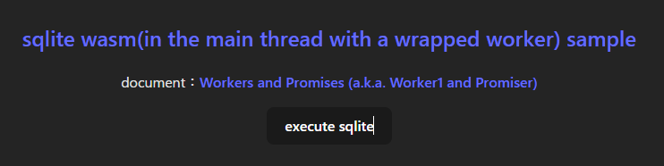
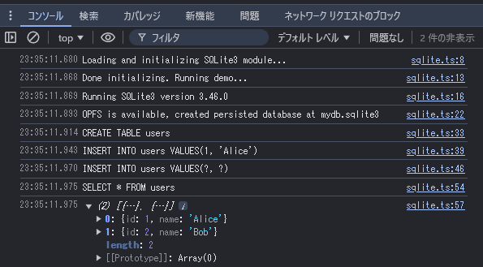

# SQLite Wasm（メインスレッドでラップされたワーカーを使用する）のサンプル

[Notionブラウザ版、WebAssembly版SQLite3でページ遷移速度を20％改善　実装時の苦労と教訓とは？](https://atmarkit.itmedia.co.jp/ait/articles/2408/16/news037.html)
という記事を読んで、思うところがあったのでサンプルプログラムを作成しました。

npmパッケージ[SQLite Wasm](https://www.npmjs.com/package/@sqlite.org/sqlite-wasm)のページには、利用方法が3つ記載されています
1. [in the main thread with a wrapped worker](https://www.npmjs.com/package/@sqlite.org/sqlite-wasm#in-a-wrapped-worker-with-opfs-if-available) (🏆 preferred option)
1. [in a worker](https://www.npmjs.com/package/@sqlite.org/sqlite-wasm#in-a-worker-with-opfs-if-available)
1. [in the main thread](https://www.npmjs.com/package/@sqlite.org/sqlite-wasm#in-the-main-thread-without-opfs)

このうち2. と3. については以前サンプルコードを作成して試してみたのですが、1. の[in the main thread with a wrapped worker](https://www.npmjs.com/package/@sqlite.org/sqlite-wasm#in-a-wrapped-worker-with-opfs-if-available)は試していなかったので、サンプルコードを作成して実際に動くところを確認しようと思います

※1. に関する[公式ドキュメント(Workers and Promises (a.k.a. Worker1 and Promiser))](https://sqlite.org/wasm/doc/trunk/api-worker1.md)がとてもわかりづらかったこと、(2. 3.は型定義があるのに)1.は型定義が作成されていなかった(ので余計にわかりづらかった)ことが原因です


## sqlite.ts

```typescript:sqlite.ts
import { sqlite3Worker1Promiser } from '@sqlite.org/sqlite-wasm';

const log = console.log;
const error = console.error;

export const initializeSQLite = async () => {
  try {
    log('Loading and initializing SQLite3 module...');
    const promiser = await sqlite3Worker1Promiser.v2({
      // debug: log,
    });

    log('Done initializing. Running demo...');

    const configResponse = await promiser('config-get', {});
    log('Running SQLite3 version', configResponse.result.version.libVersion);

    const openResponse = await promiser('open', {
      filename: 'file:mydb.sqlite3?vfs=opfs',
    });
    const { dbId } = openResponse;
    log(
      'OPFS is available, created persisted database at',
      openResponse.result.filename.replace(/^file:(.*?)\?vfs=opfs$/, '$1')
    );
    // Your SQLite code here.
    // テーブル作成
    let response = null;
    response = await promiser('exec', {
      dbId: dbId,
      sql: `CREATE TABLE IF NOT EXISTS users(id INTEGER, name TEXT)`,
    });
    log('CREATE TABLE users');

    response = await promiser('exec', {
      dbId: dbId,
      sql: `INSERT INTO users VALUES(1, 'Alice')`,
    });
    log(`INSERT INTO users VALUES(1, 'Alice')`);

    response = await promiser('exec', {
      dbId: dbId,
      sql: `INSERT INTO users VALUES(?, ?)`,
      bind: [2, `Bob`],
    });
    log(`INSERT INTO users VALUES(?, ?)`);

    const values = await promiser('exec', {
      dbId: dbId,
      sql: `SELECT * FROM users`,
      rowMode: 'object',
      returnValue: 'resultRows',
    });
    log(`SELECT * FROM users`);

    // show results
    console.log(values.result.resultRows);
  } catch (err) {
    if (!(err instanceof Error)) {
      err = new Error(err.result.message);
    }
    error(err.name, err.message);
  }
};

```

### 画面(App.tsx)でクエリを実行する

```typescript:App.tsx
import './App.css';

import { initializeSQLite } from './sqlite';

function App() {
  return (
    <>
      <div className="card">
        <h2>
          <a href="https://www.npmjs.com/package/@sqlite.org/sqlite-wasm#in-a-wrapped-worker-with-opfs-if-available">
            sqlite wasm(in the main thread with a wrapped worker) sample
          </a>
        </h2>
        <p>
          document：
          <a href="https://sqlite.org/wasm/doc/trunk/api-worker1.md">
            Workers and Promises (a.k.a. Worker1 and Promiser)
          </a>
        </p>
        <button onClick={() => initializeSQLite()}>execute sqlite</button>
        <pre id="result"></pre>
      </div>
    </>
  );
}

export default App;
```

## 動作確認

```bash
$ npm run dev
```

実行ボタンをクリックする




