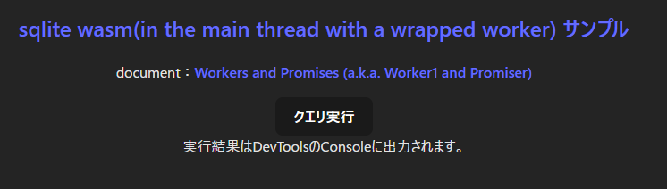
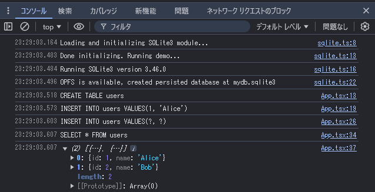
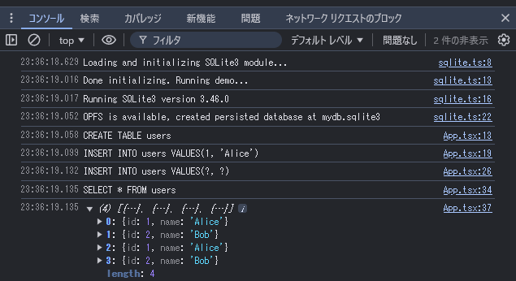

# SQLite Wasm（メインスレッドでラップされたワーカーを使用する）のサンプル

[Notionブラウザ版、WebAssembly版SQLite3でページ遷移速度を20％改善　実装時の苦労と教訓とは？](https://atmarkit.itmedia.co.jp/ait/articles/2408/16/news037.html)
という記事が話題に上がっていました（複数タブから同時アクセスする場合の苦労話）

記事を読みながら、そういえば [ラップされたWorkerをメインスレッドで実行(in the main thread with a wrapped worker)](https://www.npmjs.com/package/@sqlite.org/sqlite-wasm#in-a-wrapped-worker-with-opfs-if-available)の動作確認サンプルを作っていなかったと、思いだしたので書いてみます

npmパッケージ[SQLite Wasm](https://www.npmjs.com/package/@sqlite.org/sqlite-wasm)のページには、利用方法が3つ記載されています
1. [ラップされたWorkerをメインスレッドで実行(in the main thread with a wrapped worker)](https://www.npmjs.com/package/@sqlite.org/sqlite-wasm#in-a-wrapped-worker-with-opfs-if-available) (🏆 preferred option)
1. [Workerで実行(in a worker)](https://www.npmjs.com/package/@sqlite.org/sqlite-wasm#in-a-worker-with-opfs-if-available)
1. [メインスレッドで実行(in the main thread)](https://www.npmjs.com/package/@sqlite.org/sqlite-wasm#in-the-main-thread-without-opfs)

このうち2. と3. については以前サンプルコードを作成して試してみた([2のサンプル](https://qiita.com/murasuke/items/da6cd6b3e9e5a22804bf), [3のサンプル](https://qiita.com/murasuke/items/a428ec226355a1644c86))のですが、1. の[in the main thread with a wrapped worker](https://www.npmjs.com/package/@sqlite.org/sqlite-wasm#in-a-wrapped-worker-with-opfs-if-available)は試していなかったので、サンプルコードを作成して実際に動くところを確認しようと思います


※1. に関する[公式ドキュメント(Workers and Promises (a.k.a. Worker1 and Promiser))](https://sqlite.org/wasm/doc/trunk/api-worker1.md)がとてもわかりづらかったこと、(2. 3.は型定義があるのに)1.は型定義が作成されていなかった(ので余計にわかりづらかった)ことが原因です

### 以前書いた動作確認サンプル
https://qiita.com/murasuke/items/da6cd6b3e9e5a22804bf

https://qiita.com/murasuke/items/a428ec226355a1644c86

## 作成手順

* 画面イメージ




## プロジェクト作成

* viteでReactプロジェクトを作成

```bash
$ npm create vite@latest react_wasm_sqlite_step3 -- --template react-ts
$ cd react_wasm_sqlite_step3
$ npm install
```

### SQLiteをインストール
```bash
$ npm i @sqlite.org/sqlite-wasm
```

* `vite.config.ts`を修正

`headers`と`optimizeDeps`を追加します。
`Cross-Origin-Opener-Policy`と`Cross-Origin-Embedder-Policy`は、`OPFS`や`SharedArrayBuffer`を利用するために必要です(SQLiteが内部的に利用)。

```typescript:vite.config.ts
import { defineConfig } from 'vite';
import react from '@vitejs/plugin-react';

// https://vitejs.dev/config/
export default defineConfig({
  plugins: [react()],
  server: {
    headers: {
      'Cross-Origin-Opener-Policy': 'same-origin',
      'Cross-Origin-Embedder-Policy': 'require-corp',
    },
  },
  optimizeDeps: {
    exclude: ['@sqlite.org/sqlite-wasm'],
  },
});
```


## SQLite関係モジュール

* DBの初期化を行います

```typescript:sqlite.ts
import { sqlite3Worker1Promiser } from '@sqlite.org/sqlite-wasm';

const log = console.log;
const error = console.error;

export const connectDB = async () => {
  try {
    log('Loading and initializing SQLite3 module...');
    const promiser = await sqlite3Worker1Promiser.v2({
      // debug: log,
    });

    log('Done initializing. Running demo...');

    const configResponse = await promiser('config-get', {});
    log('Running SQLite3 version', configResponse.result.version.libVersion);

    const openResponse = await promiser('open', {
      filename: 'file:mydb.sqlite3?vfs=opfs',
    });
    const { dbId } = openResponse;
    log(
      'OPFS is available, created persisted database at',
      openResponse.result.filename.replace(/^file:(.*?)\?vfs=opfs$/, '$1')
    );

    return { dbId, promiser };
  } catch (err) {
    if (!(err instanceof Error)) {
      err = new Error(err.result.message);
    }
    error(err.name, err.message);
  }
};

export const closeDB = async ({ dbId, promiser }) => {
  try {
    const response = await promiser('close', { dbId: dbId });
  } catch (err) {
    if (!(err instanceof Error)) {
      err = new Error(err.result.message);
    }
    error(err.name, err.message);
  }
};

```

### 画面(App.tsx)でクエリを実行する

* DB接続処理を呼び出します
* テーブルが存在しない場合は作成して追加します
* DBにInsertを行った後、追加したデータをコンソールに表示します

※DBのデータは永続化されているので、ブラウザを閉じても消えません

```typescript:App.tsx
import './App.css';
import { connectDB, closeDB } from './sqlite';
const log = console.log;

function App() {
  const executeQuery = async () => {
    const db = await connectDB();
    let response = null;
    response = await db.promiser('exec', {
      dbId: db.dbId,
      sql: `CREATE TABLE IF NOT EXISTS users(id INTEGER, name TEXT)`,
    });
    log('CREATE TABLE users');

    response = await db.promiser('exec', {
      dbId: db.dbId,
      sql: `INSERT INTO users VALUES(1, 'Alice')`,
    });
    log(`INSERT INTO users VALUES(1, 'Alice')`);

    response = await db.promiser('exec', {
      dbId: db.dbId,
      sql: `INSERT INTO users VALUES(?, ?)`,
      bind: [2, `Bob`],
    });
    log(`INSERT INTO users VALUES(?, ?)`);

    const values = await db.promiser('exec', {
      dbId: db.dbId,
      sql: `SELECT * FROM users`,
      rowMode: 'object',
      returnValue: 'resultRows',
    });
    log(`SELECT * FROM users`);

    // show results
    log(values.result.resultRows);

    // close
    await closeDB(db);
  };
  return (
    <>
      <div className="card">
        <h2>
          <a href="https://www.npmjs.com/package/@sqlite.org/sqlite-wasm#in-a-wrapped-worker-with-opfs-if-available">
            sqlite wasm(in the main thread with a wrapped worker) サンプル
          </a>
        </h2>
        <p>
          document：
          <a href="https://sqlite.org/wasm/doc/trunk/api-worker1.md">
            Workers and Promises (a.k.a. Worker1 and Promiser)
          </a>
        </p>

        <button onClick={() => executeQuery()}>クエリ実行</button>
        <div className="return">
          実行結果はDevToolsのConsoleに出力されます。
        </div>
      </div>
    </>
  );
}

export default App;

```

## 動作確認

```bash
$ npm run dev
```

* クエリ実行 初回実行時(2行追加されています)



* 一旦ブラウザを閉じて、再度開いてからクエリ実行

データが永続化されているため、4行データが追加されています


